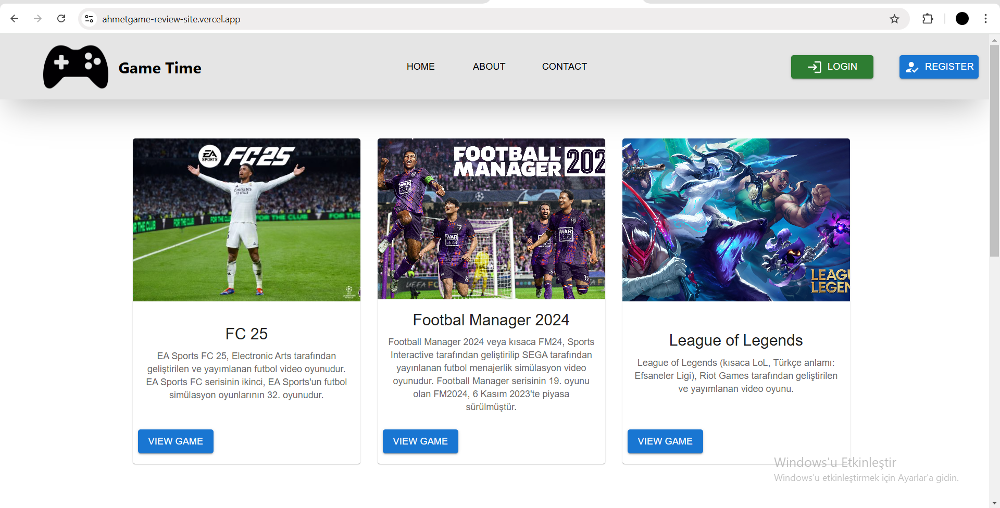
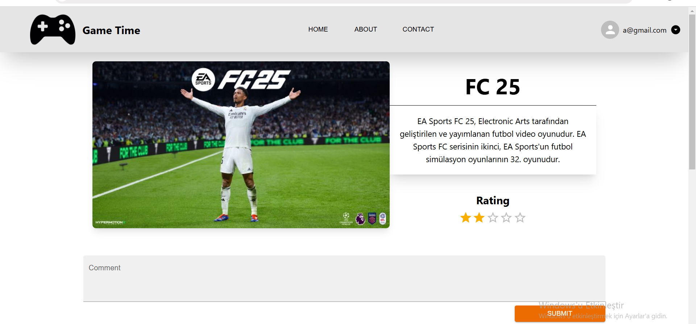
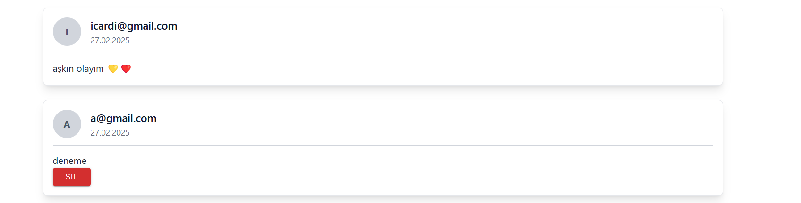

<h1>Game Review Site</h1>
<h3>About the project</h3>

This project aims to create a game review platform where users can comment on games. Using React, Redux, Firebase, MUI the goal is to develop an efficient system with a modern, user-friendly interface.

 

 
<h2>Installation 🔗</h2>
<ol>
        <li>Clone the repository:
            <pre><code>git@github.com:ahmetKaleli/game_review_site.git</code></pre>
        </li>
        <li>Install dependencies:
            <pre><code>npm install</code></pre>
        </li>
        <li>Start the development server:
            <pre><code>npm run dev</code></pre>
        </li>
</ol>

 
<h2>Technologies 🧑‍💻</h2>
 <ul>
        <li>React</li>
        <li>Redux</li>
        <li>Firebase (Firestore, Authentication)</li>
        <li>React Router DOM</li>
        <li>Tailwind CSS</li>
        <li>Material UI</li>
</ul>